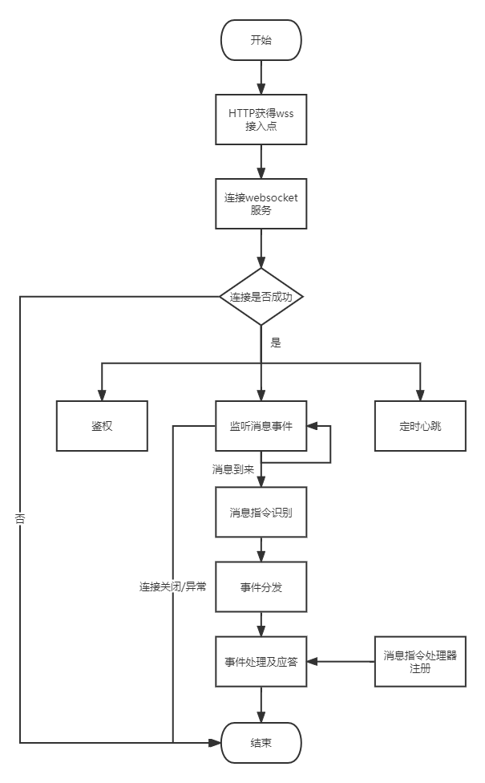
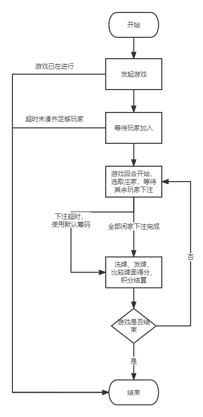

# QQ频道牛牛游戏机器人Python实现


# 方案设计

### 牛牛游戏介绍

> 牛牛游戏，又名“斗牛”游戏。该游戏由2到5人玩一副牌（52张，不含大小王），其中一家为庄家，其余为闲家，发完牌后即可开牌比牌，庄家与所有闲家一一进行比较，牌型大者为赢，牌型小者为输。
>—— 来自百度百科

***本项目针对qq机器人场景，通过玩家与机器人交互进行牛牛游戏，支持多频道多人同时进行***

项目地址：https://github.com/moli-L/bullfightgame

玩法规则（限本项目）

- 牌型比较：五花牛牛 > 牛牛 > 牛X > 无牛
- 分数比较：牛9 > 牛8 > 牛7 > 牛6 > 牛5 > 牛4 > 牛3 > 牛2 > 牛1
- 牌面分数：10、J、Q、K都为10，其他按牌面数字计算
- 牌大小比较：K > Q > ... > 2 > A
- 牌面得分相同：庄家胜
- 积分赔率：五花(x4), 牛牛(x3), 牛7牛8牛9(x2), 其他(x1)

如何计算“牛”

- 任意3张牌之和为10的整数倍数，如果另外2张牌之和不为10的整数倍数，则根据这2张牌之和的个数为该副牌的牛数。例如（4，6，Q，9，9）为“牛8”
- 任意3张牌之和都不能为10的整数倍数，则判定该副牌“无牛”。例如（7，8，A，4，J）
- 任意3张牌之和为10的整数倍数，如果另外2张牌之和也为10的整数倍数，即为牛牛。例如（7，8，5，K，10）
- 所有5张牌都是10分牌，则为“五花牛牛”

其他说明

> 本项目暂不考虑牌的花色，比较时如牌得分相同，则庄家胜


### 机器人消息事件监听处理流程




### 模块组件设计

对接机器人模块

- http: HTTP请求封装，自动添加header、处理异常，提供get、post方法
- api: 对应官方提供的api接口进行一一对应包装
- model: 对应官方不同api返回数据的对象
- ws_client: websocket连接客户端包装类，阻塞式连接，对鉴权、心跳、系统事件处理，其他事件处理等进行了封装
- bot: 机器人客户端启动类，消息指令识别分派器，提供command注解注册消息指令处理器，使用单例保证指令处理器全局只注册一次
- url: 官方提供的所有api地址
- error: 自定义异常

游戏模块

- Player: 玩家类，保存玩家基本信息以及各个回合的游戏信息
- Poker: 扑克牌类，提供洗牌、发牌、计算牌型得分等功能
- BullGame: 牛牛游戏类（游戏房间），绑定频道、记录房间内玩家、庄家、当前回合等信息，控制每回合游戏进行等
- GameStatus: 游戏进行状态枚举类
- GameManager: 游戏管理类，管理多个频道多场游戏，提供延时异步事件启动函数


### 游戏流程





# 使用说明

游戏部分不做介绍，主要介绍一下消息指令处理使用


### 游戏指令

- /游戏介绍
    > 查看游戏简介
- /游戏指令
    > 查看所有指令
- /游戏规则
    > 查看游戏规则
- /开始游戏 x
    > 发起一场x人游戏，x可选，默认为2（同一频道同时只能进行一场游戏，不同频道可以进行多场游戏）
- /加入游戏
    > 加入一场游戏
- /bet x
    > 下注x积分，x必需，空格间隔
- /查看积分
    > 查看自己当前的积分余额
- /玩家列表
    > 查看游戏房间中的所有玩家
- /结束游戏
    > 结束正在进行的游戏，只有玩家才能结束


### 安装

```
pip install -r requirements.txt
```


### 快速示例

```python
from core.bot import Bot, MessageContext
from config import appid, token

bot = Bot()

@bot.command("测试")
def introduce_handler(ctx: MessageContext):
    ctx.reply(f"测试")

if __name__ == "__main__":
    bot.run(f"{appid}.{token}")
```


### 个性化开发步骤

1. 创建bot实例
    ```python
    from core.bot import Bot
    bot = Bot()
    ```

2. 使用注解设置消息指令，并为其注册处理函数
    ```python
    @bot.command("测试")
    def introduce_handler(ctx: MessageContext):
        ctx.reply(f"测试")
    ```
    解释：注册一个`测试`指令，可以通过`/测试`触发，该指令默认传入一个`MessageContext`对象，可以调用reply函数快速回复消息;
    指令以及函数里的内容你可以任意编写

3. 项目启动
    调用 bot 的 run 方法并传入 appid 和 token 即可：
    ```python
    bot.run(f"{appid}.{token}")
    ```

4. 修改指令前缀
    ```python
    bot = Bot(">") #前缀修改为 >
    ```

5. 接收指令自定义参数
    - 单个参数
    ```python
    @bot.command("测试")
    def introduce_handler(ctx, value):
        ctx.reply(f"测试")
    ```
    使用指令`/测试 1`，1将自动填入value，并且，整型和浮点型数据会自动识别并转化，即这里的value是 int 类型而不是 str；

    - 多个参数
    ```python
    @bot.command("测试")
    def introduce_handler(ctx, *value):
        ctx.reply(f"测试")
    ```
    使用指令`/测试 1 2 3 4`，任意多个参数使用空格分隔，参数存储到value元组中，同样的，会自动进行数字类型转换；
    

### 参考链接

[QQ机器人](https://bot.q.qq.com/wiki/)
[开发文档](https://bot.q.qq.com/wiki/develop/api/)
[官方PythonSDK](https://bot.q.qq.com/wiki/develop/pythonsdk/)

